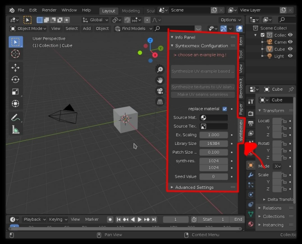

Syntexmex is an addon for blender which helps generating
UV-textures based on examples. Below are a couple examples what
can be done with this addon:

<!--more-->

<!--
  
  
  
  

-->

## Installation

### Option 1:

Download the zip file from this location:

TODO: 

After downloading, open blender and go to:

    Edit -> Preferences -> Add-ons -> Install...

Choose the downloaded zip file and press

    "Install Add-on from File..."

Afterwards in Preferences, 
search for the **Syntexmex** plugin and
put a checkmark in the box to enable the addon.nn

<!--
<table>
<tr>
<td> </td>
<td></td>
</tr></table>
-->
### Option 2 (not recommended):

building the addon form source is quiet complicated as it involves 
a lot of 3rd party libraries.

These are:

skimage, shapely, pynndescent, Pillow, decorator, sklearn, scipy, numba, 
networkx, PIL, llvmlite

after the add-on directory has been copied into
the blender addons directory (TODO; where?),
these libraries have to be copied into a "lib/" directory
inside of the blender plugin.

## How to Use the Add-on

### Where to find it

The Addon can be accessed through the properties sidebar in
3D View (Access with shortcut key: 'N') in a the *syntexmex* tab

### Quick introduction

In this tutorial, we chose this material here, 
but you are free to choose any material
you want. As long as it involves 
image-textures this algorithm will
work:

https://www.blenderkit.com/get-blenderkit/bd05e68d-9775-43dc-9b65-9fda1aa8e37a/

With Suzanne, you will get a 

### Operations

Synthesize UV example based texture
:

Synthesize textures to UV islands
:

Make UV seams seamless
:

### Parameters

source material
:

source texture
:

ex. scaling
:

library size
:

patch size ratio
:

synth-res
:

seed value
:

### Advanced Settings

debugging options
: Turn detailed debugging in console on/off.

## Some hints

- make Sure to unwrap the UVs of your model. You will want
  to make sure that there are no overlapping UVs. The same rules apply here
  as for every other UV-unwrapping process. Good results can be achieved
  when UVs aren't too warped, and areas of UV faces correspond to the actual
  face areas. Also there should be a little gap of at least a couple pixels
  between each UV island to prevent textures from bleeding into
  other uv faces.

- make sure when using "subdivision modifier" to put Options on "Sharp",
  because otherwise seams are going to be visible again due to the smoothing
  of UV coordinates

- increase patch size for better adherence to the patterns found
  in the example image

  
- alorithm automatically iterates over the longer of two edges and
  writes pixels from there into the face of the shorter edge

